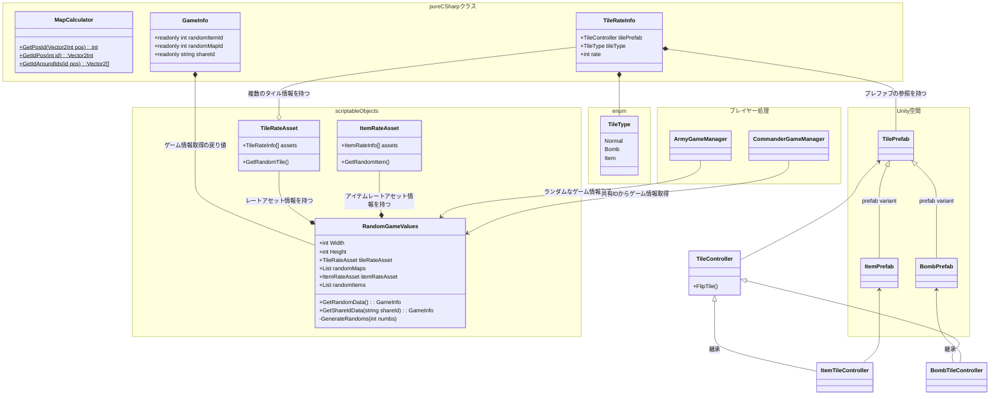
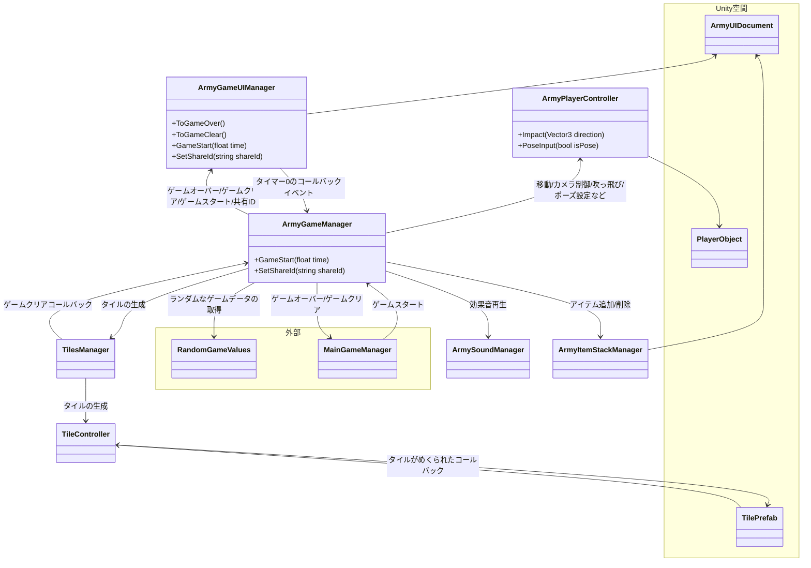
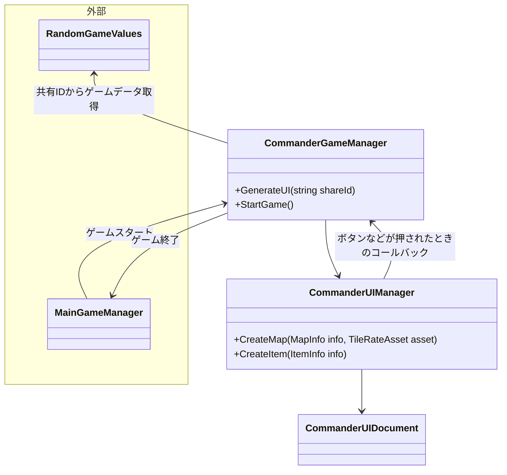

MapCalculatorはstatic関数。周りの爆弾の数字計算したりするときに使う→アイテム次第では不要かも
RandomMapsはTileRateAsset/ItemRateAssetで定義した割合情報とそれをもとにランダムなマップ/アイテムセットを生成、保持する(listのrandomMaps/randomItems)
- 非実行時に実行可能なマップとアイテムのランダム生成関数を持つ

