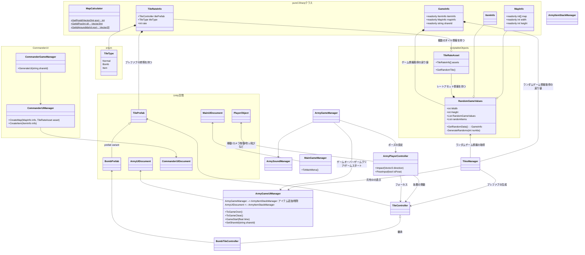

Army=操作プレイヤー
Commander=操作プレイヤー

MapCalculatorはstatic関数。周りの爆弾の数字計算したりするときに使う→アイテム次第では不要かも
RandomMapsはTileRateAssetで定義した割合情報とそれをもとに生成したマップとアイテムの乱数を持つ
- 非実行時に実行可能なマップとアイテムのランダム生成関数を持つ
- ランダムなデータとその共有IDの取得

ItemStackManagerはUI管理も兼任する