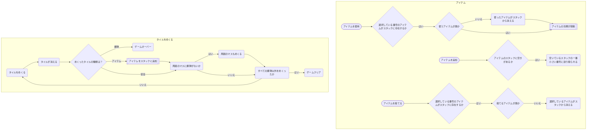
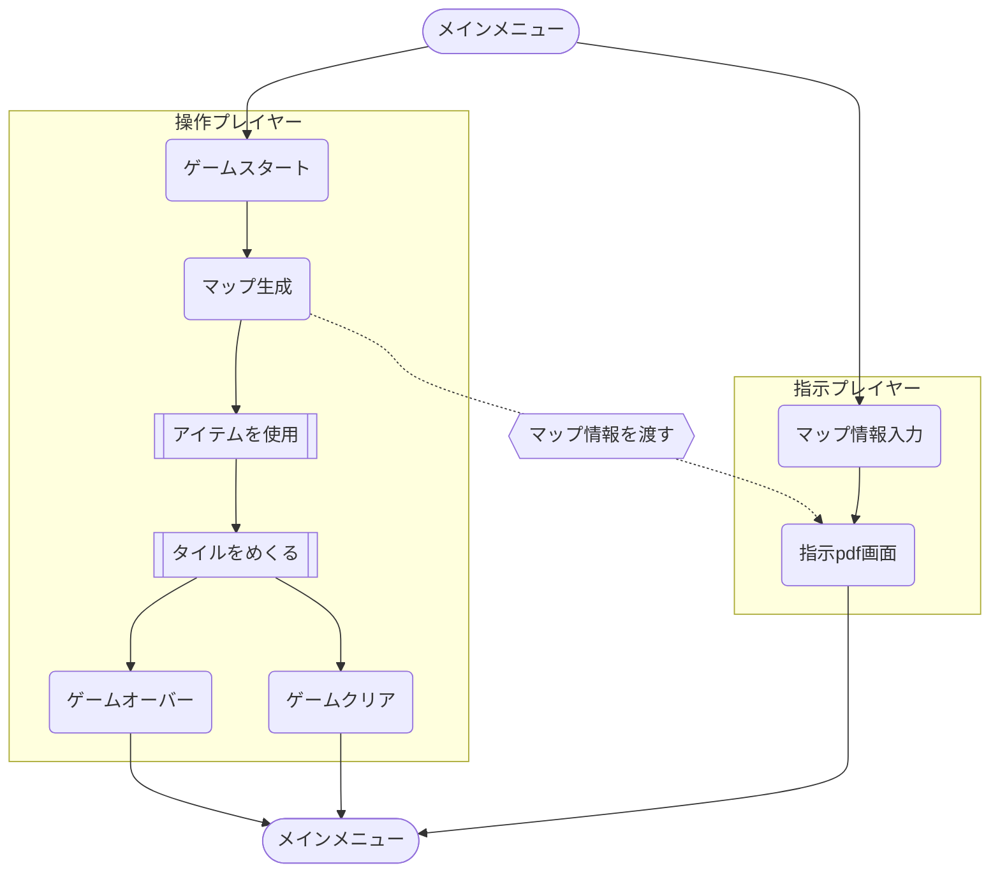

```mermaid
graph TD;

subgraph アイテム
    useItem1([アイテムを使用])-->useItemSwitch1{選択している番号のアイテムがスタックに存在するか}--はい-->useItemSwitch2{使うアイテムが旗か}
    useItemSwitch2--いいえ-->useItem2(使ったアイテムがスタックから消える)-->useItem3[[アイテムの効果が発動]]
    useItemSwitch2--はい-->useItem3

    addItem1([アイテムを追加])-->addItemSwitch{アイテムのスタックに空きがあるか}--はい-->addItem3(空いているスタックの一番小さい番号に割り振られる)

    removeItem1([アイテムを捨てる])-->removeItemSwitch1{選択している番号のアイテムがスタックに存在するか}--はい-->removeItemSwitch2{捨てるアイテムが旗か}--いいえ-->removeItem2(選択しているアイテムがスタックから消える)
end
subgraph タイルをめくる
    card1(タイルをめくる)-->card2(タイルが消える)
    card2-->cardSwitch1{めくったタイルの種類は？}
    cardSwitch1--爆弾-->cardEnd1(ゲームオーバー)
    cardSwitch1--アイテム-->card3[[アイテムをスタックに追加]]
    card3-->cardSwitch3
    cardSwitch1--安全-->cardSwitch3(周囲のマスに爆弾がないか)
    cardSwitch3--はい-->card4(周囲のマスもめくる)
    card4-->cardSwitch2
    cardSwitch2--はい-->cardEnd2(ゲームクリア)
    cardSwitch3--いいえ-->cardSwitch2(すべての爆弾以外をめくったか)
    cardSwitch2--いいえ-->card1
end
```

```mermaid
graph TD;
start1([メインメニュー])-->ope1(ゲームスタート)
ope7-->end1([メインメニュー])
ope8-->end1
inst2-->end1

start1-->inst1(マップ情報入力)
    subgraph 操作プレイヤー
        ope1-->ope3(マップ生成)
        ope3-->ope4[[アイテムを使用]]
        ope4-->ope5[[タイルをめくる]]
        ope5-->ope7(ゲームオーバー)
        ope5-->ope8(ゲームクリア)
    end
    subgraph 指示プレイヤー
        inst1-->inst2(指示pdf画面)
    end

    ope3-.-trans{{マップ情報を渡す}}
    trans-.->inst2
```