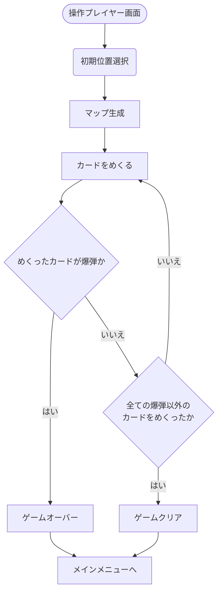

```mermaid
graph TD;
    start1([操作プレイヤー画面])-->node1(初期位置選択);
    node1-->node2[マップ生成];
    node2-->node3[カードをめくる];
    node3-->switch1{めくったカードが爆弾か};
    switch1--はい-->node4[ゲームオーバー];
    node4-->node8[メインメニューへ];
    switch1--いいえ-->switch2{全ての爆弾以外の\nカードをめくったか};
    switch2--いいえ-->node3;
    switch2--はい-->node5[ゲームクリア];
    node5-->node8;
```