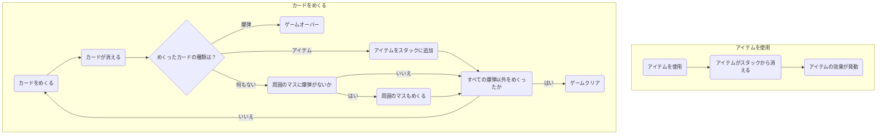
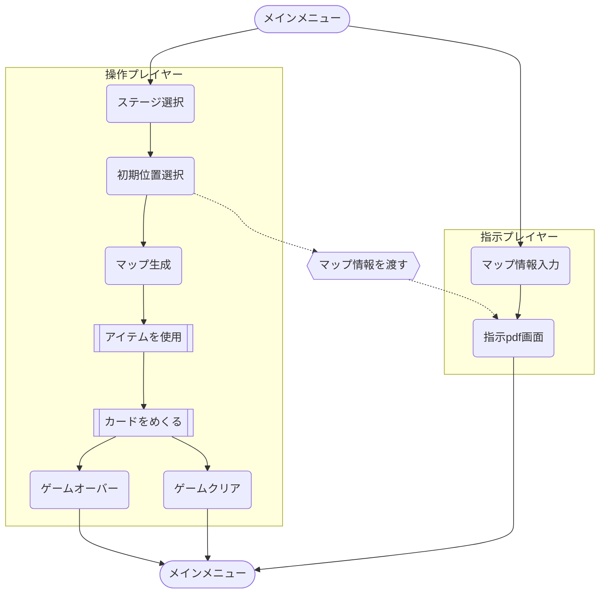

```mermaid
graph TD;

subgraph アイテムを使用
    item1(アイテムを使用)-->item2(アイテムがスタックから消える)-->item3(アイテムの効果が発動)
end
subgraph カードをめくる
    card1(カードをめくる)-->card2(カードが消える)
    card2-->cardSwitch1{めくったカードの種類は？}
    cardSwitch1--爆弾-->cardEnd1(ゲームオーバー)
    cardSwitch1--アイテム-->card3(アイテムをスタックに追加)
    card3-->cardSwitch2
    cardSwitch1--何もない-->cardSwitch3(周囲のマスに爆弾がないか)
    cardSwitch3--はい-->card4(周囲のマスもめくる)
    cardSwitch3--いいえ-->cardSwitch2(すべての爆弾以外をめくったか)
    card4-->cardSwitch2
    cardSwitch2--はい-->cardEnd2(ゲームクリア)
    cardSwitch2--いいえ-->card1
end

```

```mermaid
graph TD;
start1([メインメニュー])-->ope1(ステージ選択)
ope7-->end1([メインメニュー])
ope8-->end1
inst2-->end1

start1-->inst1(マップ情報入力)
    subgraph 操作プレイヤー
        ope1-->ope2(初期位置選択)
        ope2-->ope3(マップ生成)
        ope3-->ope4[[アイテムを使用]]
        ope4-->ope5[[カードをめくる]]
        ope5-->ope7(ゲームオーバー)
        ope5-->ope8(ゲームクリア)
    end
    subgraph 指示プレイヤー
        inst1-->inst2(指示pdf画面)
    end

    ope2-.->trans{{マップ情報を渡す}}
    trans-.->inst2
```