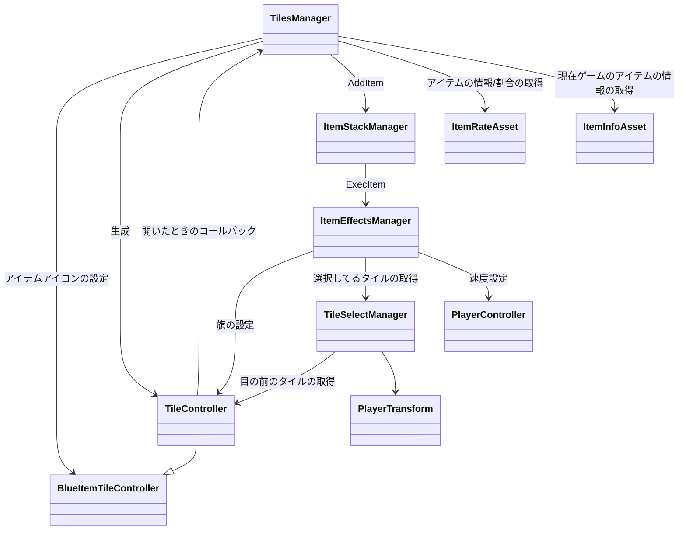

# アイテムの流れ

## TilesManager
- タイルの生成、開いたときのイベント処理などを担当する
- タイルが開いたとき→アイテム追加はここでやってる
- そんな気にすることはないかな。マップの変更とかしたくなったら使うかも
## TileController
- タイルプレファブ一つ一つについているコントローラー
- めくる処理とか旗の処理などを持つ
- これもそんな気にしないでいいカモ
## BlueItemTileController
- 青アイテムタイル用のコントローラー
- アイテムのアイコン情報を持つ。
## ItemStackManager
- アイテムをスタック/捨てる/使用するやつ
## ItemEffectManager
- アイテム効果の実行、管理を行う
- ItemTypeに応じて処理をここで一括管理する。
- ココはいっぱい触るぜ
## PlayerController
- プレイヤーを管理するやつ。
- 移動速度の変更などはこいつの関数でやる
## TileSelectManager
- プレイヤーの位置から目の前の、めくるタイルを選択するってことを常にしている
- めくる範囲の拡大とかやる場合はこの子を使う