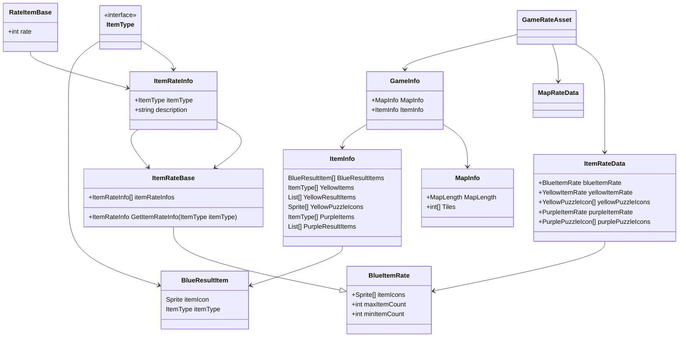

# アイテムの割合について
## ScriptableObjectについて
Scripts/Scriptables/(Defines)
データを保存できるやつ。データの型を定義→アセットを作成で特定の型のデータを無数に量産できる。
して難易度に合わせて複数のデータを作成、スクリプトにアタッチするものを変えるだけで難易度を変えるということができる

**定義**
- GameRateAsset
- MapRateAsset
- ItemRateAsset

**データ**
- GameRateData
- MapRateData
- ItemRateData

データのほうは名前は自由につけれる。
## Infoについて
rateをもとに作成される実行中のデータ。
Scripts/Kitamura/Infos

とてもシンプルなクラス

**Infoのデータ**
- GameInfo
- ItemInfo
- MapInfo

## Asset構造

## Info構造

## GameRateAsset
maprateとitemrateをまとめてもつ
まとめていじれるだけでこいつ自体は大した役割はない
## ItemRateAsset
アイテムのランダム生成の割合を持つ
## BlueItemRate
青のアイテムの割合とかを持つ
- アイコンの一覧
- 最大アイテム種類数
- 最小アイテム種類数
- アイテム種類の一覧
## ItemRateInfo
アイテム割合とかの情報
- 割合
- アイテムの種類
- 説明文
## RateItemBase
アイテムの割合の基礎クラス。こいつがあることで青/黄/紫で共通のランダム取得処理ができる
## MapRateAsset
マップの生成の割合を持つ。こっちのほうがやってることは単純

## GameInfo
mapinfoとiteminfoをもつ。こいつは生成時に乱数を渡すという役割がある
## mapinfo
割合をもとに作られたマップ情報
## iteminfo
割合をもとに作られたアイテム情報
## BlueResultItem
アイテムアイコン/アイテム種類のデータ。

