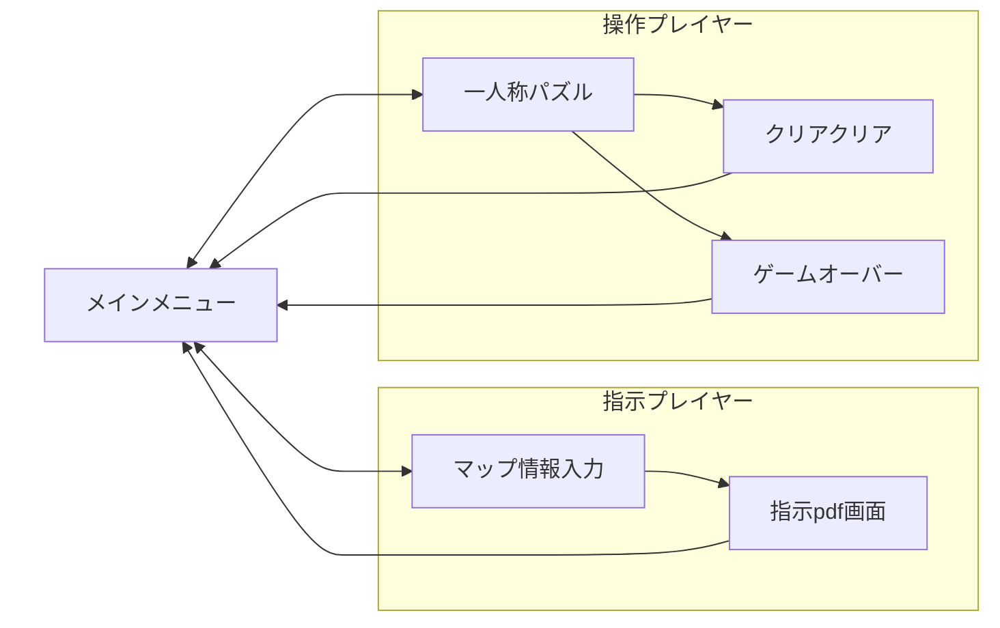

```mermaid
graph LR
style mainMenu fill: #fff, stroke: #fff, color: #fff

    subgraph mainMenu
        メインメニュー
    end
    メインメニュー<-->マップ情報入力
    メインメニュー<-->一人称パズル
    subgraph introductionPlayer [指示プレイヤー]
        マップ情報入力-->指示pdf画面
    end
    subgraph playPlayer [操作プレイヤー]
        一人称パズル
        一人称パズル-->クリアクリア
        一人称パズル-->ゲームオーバー
    end
    クリアクリア-->メインメニュー
    ゲームオーバー-->メインメニュー
    指示pdf画面-->メインメニュー
```