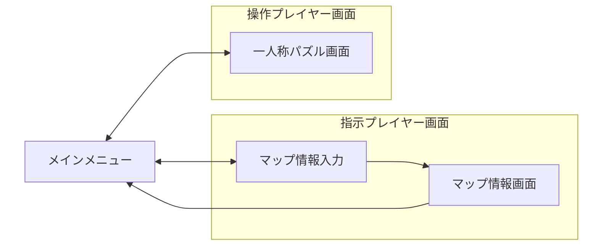

```mermaid
graph LR
style mainMenu fill: #fff, stroke: #fff, color: #fff

    subgraph mainMenu
        メインメニュー
    end
    メインメニュー<-->マップ情報入力
    メインメニュー<-->一人称パズル画面
    subgraph introductionPlayer [指示プレイヤー画面]
        マップ情報入力-->マップ情報画面
    end
    subgraph playPlayer [操作プレイヤー画面]
        一人称パズル画面
    end
    マップ情報画面-->メインメニュー
```