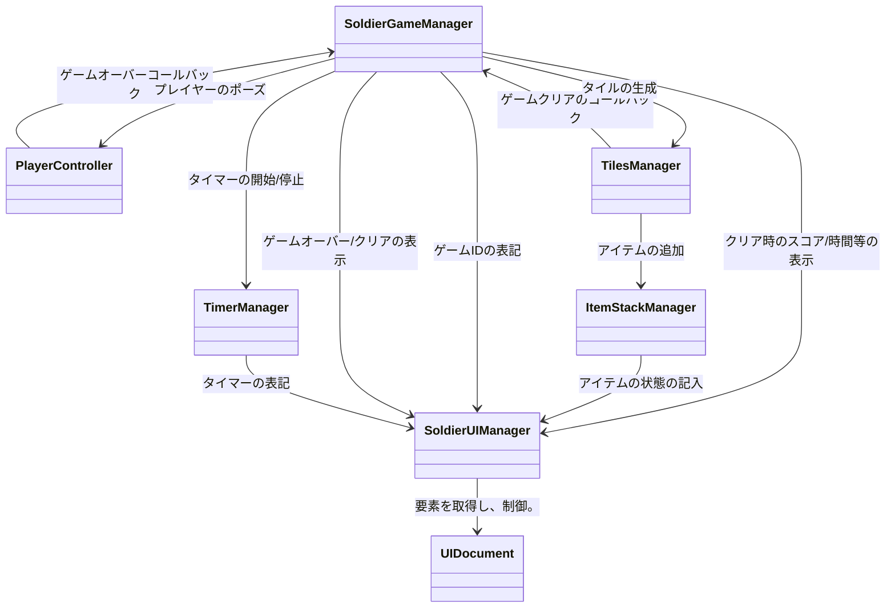

こんな感じにしたいかな～かなり急いで作ったのでうまくいってない部分まだあるかも

## SoldierGameManager
- ゲームの開始、ゲームオーバー/クリアを制御
- 上記にまつわるイベントとかそれによる制御を持つ
    - ゲームの開始
        - タイルの生成
        - タイマーの開始
    - ゲームオーバー/クリア
        - プレイヤーポーズ
        - タイマー停止
    - など
- ゲームのスコアなんかもこの子がtimermanager、tilesmanager等から各種取得し、まとめてuimanagerに渡す
## TimerManager
- タイマー系の情報を持ち、その書き込みをui側に指示する
- ちょっと冗長かも？gamemanagerかuimanagerに統合してもいい
## TilesManager
- タイルの制御を担当する
- 残りの爆弾数とかはこいつがもってる
## ItemStackManager
- アイテムスタックの管理
- アイテムを使ったりゲットしたりしたらこいつからuiを変更する

(余裕があったらitemstack/timer側にcallbackイベント定義して、uimanager側から取りに行く感じにしたい)